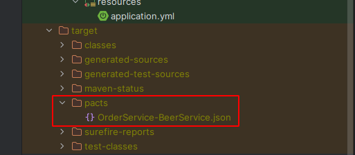
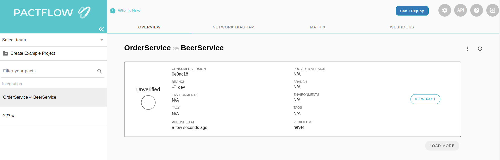
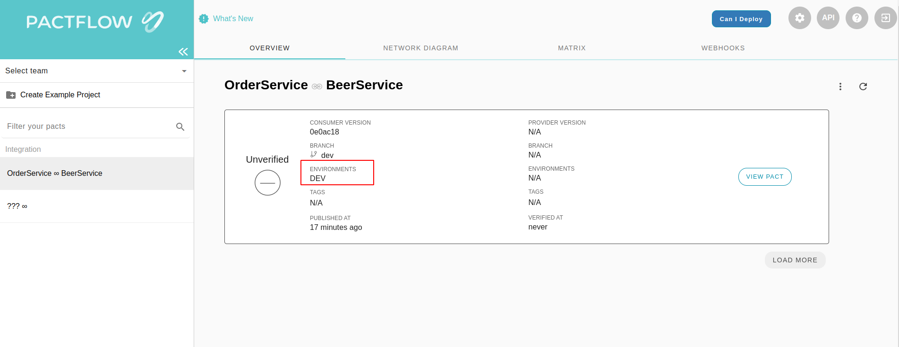
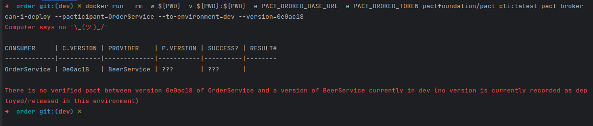

## Contract Test - Consumer

---

### **Configuration**

*   **Spring**

```xml
<dependency>
    <groupId>org.springframework.boot</groupId>
    <artifactId>spring-boot-starter-test</artifactId>
    <scope>test</scope>
</dependency>
```

*   **pact**

```xml
<dependency>
    <groupId>au.com.dius.pact.consumer</groupId>
    <artifactId>junit5</artifactId>
    <version>4.4.7</version>
</dependency>
```

*   **mongo**

```xml
<dependency>
    <groupId>de.flapdoodle.embed</groupId>
    <artifactId>de.flapdoodle.embed.mongo.spring30x</artifactId>
    <version>4.3.2</version>
    <scope>test</scope>
</dependency>
```

> It is possible to use testcontainer to mock the resources during the tests, too.

*   **Junit**

```xml
<dependency>
    <groupId>org.junit.jupiter</groupId>
    <artifactId>junit-jupiter-api</artifactId>
    <version>5.7.2</version>
    <scope>test</scope>
</dependency>
<dependency>
    <groupId>org.junit.jupiter</groupId>
    <artifactId>junit-jupiter-engine</artifactId>
    <version>5.7.2</version>
    <scope>test</scope>
</dependency>
```

---

### **Test Class**

    > This is an example of an integration test that starts the microservice, makes a request to the provider and asserts the data expected to create the contract.

```java
@SpringBootTest(webEnvironment = SpringBootTest.WebEnvironment.RANDOM_PORT,
                classes = {OrderApplication.class})
@ExtendWith(PactConsumerTestExt.class)
@PactTestFor(pactVersion = PactSpecVersion.V3, providerName = "BeerService")
public class OrderServiceClientPactTest {

  @MockBean private ItemService itemService;

  @Pact(consumer = "OrderService")
  public RequestResponsePact getOneBeer(PactDslWithProvider builder) {

    return builder
        .given("beer exists")
        .uponReceiving("get beer by Id")
        .path("/beer/63c18997cf5ec173590cc15a")
        .willRespondWith()
        .status(200)
        .body(
            new PactDslJsonBody()
                .stringType("id", "63c18997cf5ec173590cc15a")
                .stringType("name", "BHRAMA")
                .stringType("brand", "AMBEV")
                .numberType("price", new BigDecimal("3.54"))
                .stringType("type", "Beer"))
        .toPact();
  }

  @Test
  @PactTestFor(pactMethod = "getOneBeer")
  void testOneBeer(MockServer mockServer) throws ServiceUnavailableException {

    itemService = new ItemService(mockServer.getUrl(), new RestTemplate());
    final ItemResponse itemResponseReq =
        itemService.retrieveItemPrice(new BeerItem("63c18997cf5ec173590cc15a", 2));

    assertEquals("63c18997cf5ec173590cc15a", itemResponseReq.getId());
    assertEquals("BHRAMA", itemResponseReq.getName());
    assertEquals("63c18997cf5ec173590cc15a", itemResponseReq.getId());
    assertEquals("AMBEV", itemResponseReq.getBrand());
    assertEquals("Beer", itemResponseReq.getType());
  }
}
```

*   **Class annotations**
    *   `@SpringBootTest` starts the spring boot to make integration tests called the API.
    *   `@ExtendWith(PactConsumerTestExt.class)` is used during the unit tests to use the pact implementation.
    *   `@PactTestFor(providerName = "BeerService")` pact annotation that informs which provider the tests should be directed to.
*   `@MockBean private ItemService itemService` service instance that will be used to execute the integration with the provider.
*   **Mock Method**
    *   `@PactTestFor(pactVersion = PactSpecVersion.V3, providerName = "BeerService")` annotation to tell which service requires the data.
    *   `PactDslWithProvider` the parameter that provides a builder to make the request and response expected between the two services.
*   **Unit Test**
    *   `@Test` Annotation that identifies the method below the code as a unit test.
    *   `@PactTestFor(pactMethod = "getOneBeer")` is an annotation that links the mock method created for the unit test to when the provider service was called. The mock will respond to the expected data mapping for the unit test to do the assertion.
    * > **IMPORTANT** The method "given" is used to link between consumer and provider to use the correct state in provider service. 

---

### **Execution**

After mapping all contract tests, we need to generate the artifacts that will be published to the pact broker.

Execute `mvn clean test` and wait for the build and test to conclude.

When the build is finished, it is in the folder `target/pacts`, a new JSON file that informs the contract between consumer and provider by the tests mapped.  


---

### **Pact Broker Operations**

To publish the contract, it is possible to use the project management tool (maven, gradle, etc), but there are some limitations to use, like setting the environment in which the contract was published or verifying the latest contracts between the consumer and provider are OK.

The pact provides the user with a tool called Pact CLI, which integrates with the pact broke and do all the operations available there.

[Documentation](https://docs.pact.io/implementation_guides/cli)

Also, you can use the docker image that the tool offers.

[Docker Pact CLI](https://hub.docker.com/r/pactfoundation/pact-cli)

---

### **Publication**

To publish we will use the docker image that makes all the connections with the pact broker.

```plaintext
docker run --rm -w ${PWD} -v ${PWD}:${PWD} -e PACT_BROKER_BASE_URL -e PACT_BROKER_TOKEN pactfoundation/pact-cli:latest publish ${PWD}/target/pacts/OrderService-BeerService.json --consumer-app-version=${GIT_COMMIT} --branch=${ENV}
```

Definitions:

*   `${PWD}` the current path that the command will run
*   `PACT_BROKER_BASE_URL` Url of the pact broker
*   `PACT_BROKER_TOKEN` Token to access the pact broker
*   `--consumer-app-version` property to inform which version of the contract will be published
*   `--branch` is the name of the branch that will be published in the contract.

The provider will be published and will be available to check on the pact broker website  


---

### **Environment**

Looking at the image above we can see that the environment was not already there, after publishing a contract, it is important that we set the environment in the new contract that was published. To do this operation, the pact CLI has a command to do it.

```plaintext
docker run --rm -w ${PWD} -v ${PWD}:${PWD} -e PACT_BROKER_BASE_URL -e PACT_BROKER_TOKEN pactfoundation/pact-cli:latest pact-broker record-deployment --pacticipant=OrderService --version=${GIT_COMMIT} --environment=${ENV}
```

Definitions:

*   `${PWD}` the current path that the command will run
*   `PACT_BROKER_BASE_URL` Url of the pact broker
*   `PACT_BROKER_TOKEN` Token to access the pact broker
*   `--pacticipant` property to inform the provider name of the contract published
*   `--version` is the version of the contract published.
*   `--environment` references the environment in which the contract was published and used to validate the consumer service.



---

### **Deploy**

To validate if it is possible to deploy a version of the provider safely, we can run a feature from a pact called "Can I Deploy". It is a feature that validates the latest version of a contract between a consumer and a provider.

To check if it is possible to deploy the code, we can run this command:

```plaintext
docker run --rm -w ${PWD} -v ${PWD}:${PWD} -e PACT_BROKER_BASE_URL -e PACT_BROKER_TOKEN pactfoundation/pact-cli:latest pact-broker can-i-deploy --pacticipant=OrderService --to-environment=${ENV} --version=${GIT_COMMIT}
```

Definitions:

*   `${PWD}` the current path that the command will run
*   `PACT_BROKER_BASE_URL` Url of the pact broker
*   `PACT_BROKER_TOKEN` Token to access the pact broker
*   `--pacticipant` property to inform the provider name of the contract published
*   `--to-environment` references the environment in which the contract was published and used to validate the consumer service.
*   `--version` is the version of the contract published.

